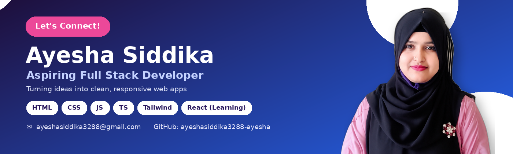

<h1 align="center">Hi 👋, I'm Ayesha Siddika</h1>
<h3 align="center">Aspiring Full Stack Developer</h3>

---

### 👩‍💻 About Me

Hi! I'm Ayesha, an aspiring Full Stack Developer currently learning modern web development. I'm building my skills in JavaScript, TypeScript, React, and other technologies used to create modern web applications. I enjoy learning new technologies, solving problems, and turning ideas into real projects. I'm currently focused on improving my frontend skills while gradually exploring backend development.

- 🎓 Diploma in Computer Science and Technology (Completed) → BSc in Computer Science and Engineering (8th of 9 semesters)
- 🎯 Goal: Becoming a professional Software Engineer
- 🧠 Passionate about problem solving & continuous learning
- 📍 Hometown: Begumganj, Noakhali | Currently in: Uttara, Dhaka

### 🚀 Currently Working On

- 🌱 Learning React and modern frontend development
- 💻 Practicing JavaScript and TypeScript
- 🎨 Building responsive interfaces with Tailwind CSS
- 🔧 Improving my Git & GitHub workflow
- 🌐 Exploring Full Stack Web Development
- 🧠 Improving my problem-solving skills

---

### 🛠️ Technology Stack

**Languages**

**CSS Frameworks & Libraries**

**Currently Learning**

**Tools & Technologies**

---

### 📊 GitHub Statistics

  
  

### 🔥 GitHub Streak

  

---

### 📌 Featured Projects

Check out my pinned repositories below 👇 

---

### 📫 Connect With Me

  
  

- 📧 Email: [ayeshasiddika3288@gmail.com](mailto:ayeshasiddika3288@gmail.com)
- 📍 Location: Uttara, Dhaka, Bangladesh

---

⭐ Thanks for visiting my profile!

